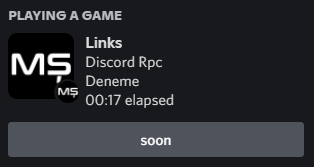

# Discord Rpc Builder | Archived

> [!NOTE]
> Since it does not works with the Discord's new UI, this project is archived. If you want to use it, you can fork and update the code.

---

Discord Rpc Builder is a Command Line Interface(CLI) that allows you to create a rich presence for your discord profile.



## Download and Run

```bash
# with node
git clone https://github.com/mertssmnoglu/discord-rpc-builder
cd discord-rpc-builder
npm install
npm run rpc

# with docker
git clone https://github.com/mertssmnoglu/discord-rpc-builder
cd discord-rpc-builder
docker build . -t mertssmnoglu/discord-rpc-builder
docker run -it mertssmnoglu/discord-rpc-builder
```

## Documentation

[🇬🇧 English](https://github.com/mertssmnoglu/discord-rpc-builder/tree/master/docs/english.md)

[🇹🇷 Turkish](https://github.com/mertssmnoglu/discord-rpc-builder/tree/master/docs/türkçe.md)

## License

[Apahe License 2.0](./LICENSE)
